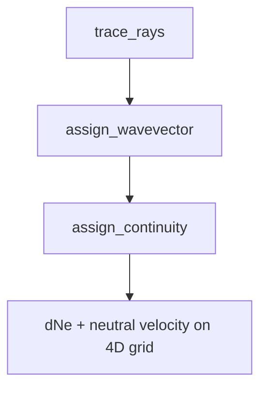

# Continuity Time Integration

Integrate the electron density perturbation through time after ray tracing and
wavevector mapping. This step solves the continuity equation on the 3-D grid
and stores a 4-D `xr.Dataset` with time-varying outputs.

## Overview



## Governing Equation

Solve the electron continuity equation with a prescribed ion velocity field:

$$
\frac{\partial \, \delta N_e}{\partial t} + \nabla \cdot \left(N_{e0}\, \mathbf{u}_e\right) = 0
$$

Use a forward-Euler update at each time step:

$$
\delta N_e^{n+1} = \delta N_e^{n} - \Delta t\, \nabla \cdot \left(N_{e0}\, \mathbf{u}_e\right)
$$

This implementation assumes $\delta N_e \ll N_{e0}$ and does not include
photo-chemical source/sink terms.

## Pulse and Neutral Velocity

Build a causal N-wave pulse with a time-dependent width:

$$
\sigma = b\, t_i
$$

$$
\mathrm{stf}(t) = \frac{\sqrt{2}}{\sigma^{3/2}\,\pi^{1/4}} (t_i - t_p)
\exp\left[-\left(\frac{t_i - t_p}{\sqrt{2}\,\sigma}\right)^2\right]
$$

$$
\mathbf{V}_n = A\,\mathrm{stf}\,\mathbf{k}
$$

- $t_i$ is infraGA travel time mapped to the grid.
- $A$ is the linear infraGA amplitude mapped to the grid.
- $\mathbf{k} = (k_r, k_t, k_p)$ is the geometry-based wavevector.

## Magnetic Projection

Project neutral velocity onto the geomagnetic field direction when enabled:

$$
\mathbf{u}_e = (\mathbf{V}_n \cdot \hat{\mathbf{b}})\, \hat{\mathbf{b}}
$$

Set the geomagnetic flag to `False` to use the neutral velocity directly.

## Spherical Divergence and Boundaries

Compute divergence in spherical coordinates. Use full 3-D divergence by
default, with a 1-D radial option via `divergence_flag=1`.

Boundary handling matches the legacy Fortran implementation:

- **Divergence operator**: clamp indices at grid edges, which applies a
  one-sided difference at the boundaries.
- **Top altitude boundary**: copy the last interior value to the top cell
  after each time step.

## Run the Continuity Step

```python
import logging

from pyionoseis.model import Model3D
from pyionoseis.source import EarthquakeSource

logging.basicConfig(level=logging.INFO)

source = EarthquakeSource("event.toml")
model = Model3D("event.toml")

model.assign_source(source)
model.make_3Dgrid()
model.assign_atmosphere()
model.assign_ionosphere()
model.assign_magnetic_field()
model.trace_rays(type="2d", az_interp=True, az_interp_step=1.0)
model.assign_wavevector(mapping_mode="nearest")

continuity = model.assign_continuity(
    output_dir="continuity_output",
    reuse_existing=True,
)

print(continuity)
```

## TOML Configuration

Store timing parameters under the `[continuity]` section:

```toml
[continuity]
# seconds
t0_s = 0.0
tmax_s = 3600.0
dt_s = 10.0
```

## Outputs

The output dataset includes:

- `dNe` — electron density perturbation (m^-3)
- `neutral_velocity_r`, `neutral_velocity_t`, `neutral_velocity_p` —
  neutral velocity components (m/s) when enabled
- `travel_time_s` and `infraga_amplitude` — mapped infraGA scalars

Use `model.continuity` to access the cached result after the run.
