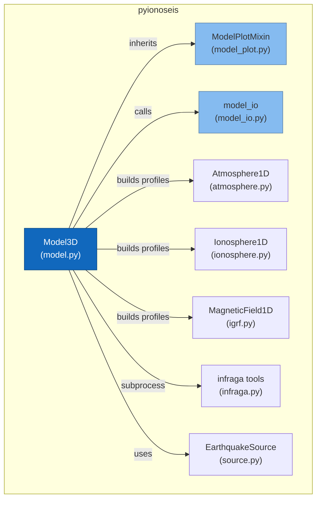
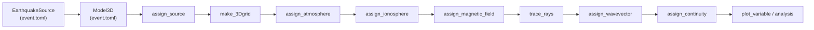
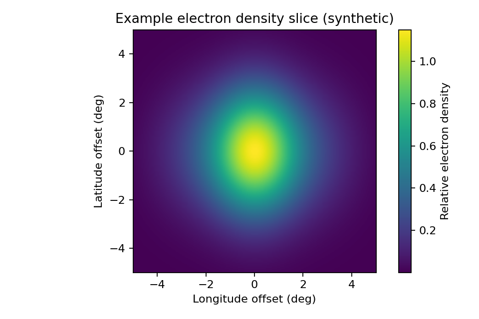
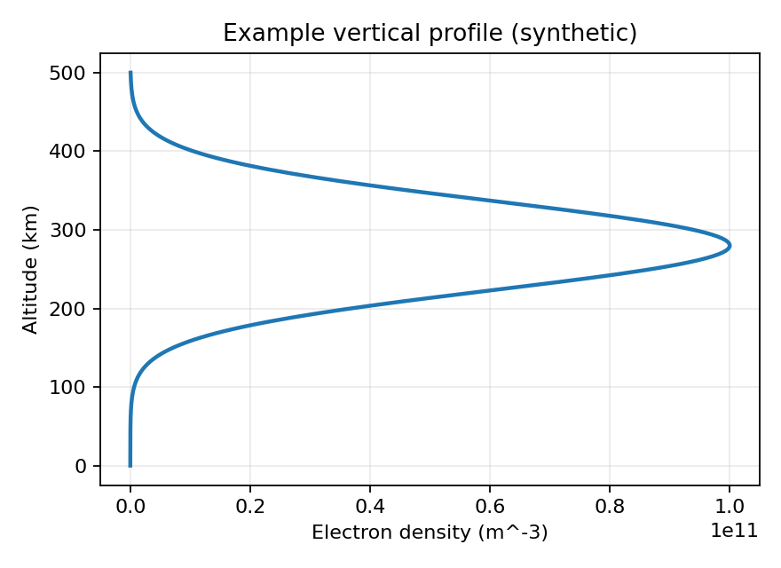

# Model Module

The `model` module is the central orchestrator of PyIonoSeis. It exposes
`Model3D` — the single object researchers interact with to build a
physics-consistent 3-D grid and run infrasound ray tracing.

## Architecture

`Model3D` delegates physics to four specialised 1-D profile classes and
one subprocess wrapper. Plotting and IO concerns are separated into
dedicated modules so the orchestrator stays focused on assembling the grid.



## Typical Workflow



Each step enriches `model.grid` (`xr.Dataset`) with new physical variables.
Steps are independent — you can stop at any point and work with the data
already computed.

## Quick Start Example

Build a grid and populate it with atmosphere, ionosphere, and magnetic field
outputs. Enable logging to see progress as the 1-D profiles are computed in
parallel.

```python
import logging

from pyionoseis.model import Model3D
from pyionoseis.source import EarthquakeSource

logging.basicConfig(level=logging.INFO)

source = EarthquakeSource("event.toml")
model = Model3D("event.toml")

model.assign_source(source)
model.make_3Dgrid()
model.assign_atmosphere()
model.assign_ionosphere()
model.assign_magnetic_field()
model.trace_rays(type="2d", az_interp=True, az_interp_step=1.0)
model.assign_wavevector(mapping_mode="nearest")
model.assign_continuity(output_dir="continuity_output")

print(model.grid)
```

## Plotting Examples

Generate common visualizations directly from the model object. These examples
assume `model.grid` has already been populated.

```python
model.plot_source()
model.plot_grid(show_gridlines=True)

model.plot_variable(variable="electron_density", altitude_slice=300)
model.plot_variable(variable="temperature")
model.plot_variable(variable="inclination", altitude_slice=250, cmap="coolwarm")

# Wavevector components
model.plot_variable(variable="kr", altitude_slice=300)
```

## Example Output Images

The images below are synthetic examples to show the expected layout and
styling of the plots produced by `ModelPlotMixin`.





## Grid Data Model

`model.grid` is always an `xr.Dataset` with three named dimensions:

| Dimension | Unit | Set by |
|-----------|------|--------|
| `latitude` | degrees | `make_3Dgrid()` |
| `longitude` | degrees | `make_3Dgrid()` |
| `altitude` | km | `make_3Dgrid()` |

Variables are added progressively:

| Variable | Unit | Added by |
|----------|------|----------|
| `grid_points` | — | `make_3Dgrid()` |
| `density` | kg m⁻³ | `assign_atmosphere()` |
| `pressure` | Pa | `assign_atmosphere()` |
| `temperature` | K | `assign_atmosphere()` |
| `velocity` | km s⁻¹ | `assign_atmosphere()` |
| `electron_density` | m⁻³ | `assign_ionosphere()` |
| `Be`, `Bn`, `Bu` | nT | `assign_magnetic_field()` |
| `Br`, `Btheta`, `Bphi` | nT | `assign_magnetic_field()` |
| `inclination`, `declination` | degrees | `assign_magnetic_field()` |
| `total_field`, `horizontal_intensity` | nT | `assign_magnetic_field()` |
| `kr`, `kt`, `kp` | — | `assign_wavevector()` |

Continuity outputs are stored separately on `model.continuity`, which is a
4-D `xr.Dataset` with dimensions `(latitude, longitude, altitude, time)`.

## Supporting Modules

### `model_io` — Caching and IO helpers

`model_io` owns all SHA-256 hashing, cache-key generation, and signature
sidecar file logic used by `trace_rays` and `load_rays`. The functions are
pure (no class required) and are imported by `Model3D` at the module level.

::: pyionoseis.model_io

### `model_plot.ModelPlotMixin` — Plotting

`ModelPlotMixin` provides all visualisation methods. `Model3D` inherits from
it, so plots are available directly on the model object. The mixin can also
be used standalone in testing scenarios.

::: pyionoseis.model_plot.ModelPlotMixin

## Wavevector Mapping

Wavevector mapping adds `kr`, `kt`, and `kp` to the grid after ray tracing.
For full examples and performance guidance, see
[Wavevector Mapping](wavevector.md).

## API Reference

::: pyionoseis.model.Model3D
