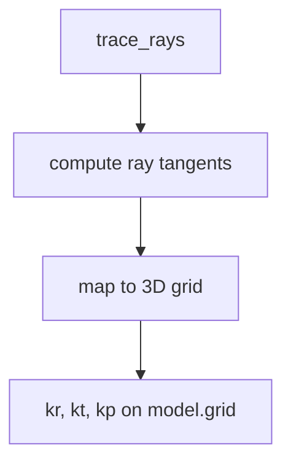

# Wavevector Mapping

Compute geometry-based wavevector components from infraGA raypaths and map them
onto the 3-D model grid. This page documents the current approximation (nearest
neighbor or weighted average) and shows how to visualize the results.

## Overview

The wavevector components (`kr`, `kt`, `kp`) are computed from ray geometry
only, so they represent **direction cosines** in the local spherical frame. You
cannot recover the exact slowness-based components without extra infraGA
outputs. Use this workflow for geometry-based approximations and visualization.



## Requirements

- Use the standard model workflow (`trace_rays` must run first).
- If you want the KD-tree nearest-neighbor path, install the optional
  dependency:

```bash
pip install "pyionoseis[wavevector]"
```

## Compute Wavevectors

Use nearest-neighbor mapping for speed. Switch to weighted averaging when you
want smoother fields at the cost of speed.

```python
import logging

from pyionoseis.model import Model3D
from pyionoseis.source import EarthquakeSource

logging.basicConfig(level=logging.INFO)

source = EarthquakeSource("event.toml")
model = Model3D("event.toml")

model.assign_source(source)
model.make_3Dgrid()
model.assign_atmosphere()
model.assign_ionosphere()
model.assign_magnetic_field()
model.trace_rays(type="2d", az_interp=True, az_interp_step=1.0)

# Fast mapping (nearest neighbor, KD-tree when available)
model.assign_wavevector(
    mapping_mode="nearest",
    interpolation_radius_km=50.0,
    altitude_window_km=50.0,
    smoothing_radius_km=0.0,
)
```

## Plot a 3-Panel Slice

Plot a representative altitude slice for `kr`, `kt`, and `kp`.

```python
import matplotlib.pyplot as plt

alt_index = len(model.grid.coords["altitude"]) // 2
alt_km = float(model.grid.coords["altitude"][alt_index].values)

fig, axes = plt.subplots(1, 3, figsize=(14, 4), constrained_layout=True)
model.grid["kr"].isel(altitude=alt_index).plot(ax=axes[0])
model.grid["kt"].isel(altitude=alt_index).plot(ax=axes[1])
model.grid["kp"].isel(altitude=alt_index).plot(ax=axes[2])

axes[0].set_title(f"k_r at {alt_km:.1f} km")
axes[1].set_title(f"k_t at {alt_km:.1f} km")
axes[2].set_title(f"k_p at {alt_km:.1f} km")

plt.show()
```

## 3-D Surface Plot (k_r)

This example stacks multiple altitude slices for a 3-D view.

```python
import matplotlib.pyplot as plt
import numpy as np
from mpl_toolkits.mplot3d import Axes3D

lat = model.grid.coords["latitude"].values
lon = model.grid.coords["longitude"].values
alt = model.grid.coords["altitude"].values

kr_all = model.grid["kr"]
kr_min = float(kr_all.min())
kr_max = float(kr_all.max())

lon_grid, lat_grid = np.meshgrid(lon, lat)

fig = plt.figure(figsize=(12, 9))
ax = fig.add_subplot(111, projection="3d")

for i in range(0, len(alt), max(1, len(alt) // 5)):
    kr_slice = model.grid["kr"].isel(altitude=i).values
    alt_grid = np.full_like(lon_grid, alt[i])

    norm_vals = (kr_slice - kr_min) / (kr_max - kr_min)
    ax.plot_surface(
        lon_grid,
        lat_grid,
        alt_grid,
        facecolors=plt.cm.viridis(norm_vals),
        shade=False,
        alpha=0.7,
    )

ax.set_xlabel("Longitude (deg)")
ax.set_ylabel("Latitude (deg)")
ax.set_zlabel("Altitude (km)")
ax.set_title("k_r Wavevector Component (3D)")

sm = plt.cm.ScalarMappable(cmap="viridis", norm=plt.Normalize(vmin=kr_min, vmax=kr_max))
sm.set_array([])
fig.colorbar(sm, ax=ax, shrink=0.5, aspect=10, label="k_r")

plt.show()
```

## Mapping Modes

Use the mapping mode that fits your performance and smoothness needs:

| Mode | Description | When to use |
| --- | --- | --- |
| `nearest` | Assign the closest ray tangent to each grid point. Uses KD-tree when available. | Fastest for large grids. |
| `weighted` | Weighted average of nearby ray tangents within a radius. | Smoother fields, higher cost. |

## Performance Tips

- Use `mapping_mode="nearest"` for speed.
- Keep `smoothing_radius_km=0.0` unless you see noisy tangents.
- Use `altitude_window_km` to limit ray candidates in the vertical direction.
- Increase `chunk_size` if you have enough memory.

## Limitations

- The components are geometry-based direction cosines, not true slowness-based
  wavevectors.
- Turning points rely on a geometry-only heuristic and may be noisy.
- Sparse ray coverage yields `NaN` values in the grid by design.

## See Also

- [Wasp3D Wave Vector](wasp3d-wavevector.md)
- [Model Module](model.md)
